# Steamakers

## Ομάδα
Η ομάδα μας αποτελείται από τρία μέλη. Τη **Μαρία**, τον **Παναγιώτη** και τον **Έκτορα**. 
Είμαστε η ομάδα των STEAMAKERS και είναι η πρώτη μας συμμετοχή σε διαγωνισμό.

## Στόχος
Δημιουργία ενός συστήματος διαχωρισμού ανακυκλώσιμων υλικών (αλουμίνιο-πλαστικό), με σκοπό την τοποθέτηση αυτού του 
μηχανήματος σε σχολική μονάδα, ώστε να αναπτύξουμε την περιβαλλοντική ευαισθητοποίηση των μαθητών/μαθητριών.

## Περιγραφή
Η κατασκευή έχει μία κεντρική είσοδο για τα απορρίμματα. Μόλις αυτά εισέρχονται, ελέγχονται από τον αδιάβροχο 
αισθητήρα απόσταση υπερήχων. Ο αισθητήρας αυτός μετράει την απόσταση. Μόλις εισέρθει το αντικείμενο στο οπτικό 
πεδίο του αισθητήρα, εκείνος το αντιλαμβάνεται ως εμπόδιο. Τότε, ο επαγωγικός αισθητήρας, ο οποίος αναπτύσσει 
μαγνητικό πεδίο γύρω του, έχει δυνατότητα να ανιχνεύσει, μέσω της τιμής που κάθε φορά δίνει, εάν το αντικείμενο 
είναι φτιαγμένο από αλουμίνιο (μέταλλο) ή όχι. Ανάλογα με τις τιμές αυτές, ο σερβοκινητήρας θα στρίψει μαζί με την 
κυλινδρική σωλήνα, η οποία θα παρασύρει μαζί της το αντικείμενο, προς την εγκοπή που οδηγεί στον κατάλληλο κάδο. 
Αυτή η διαδικασία θα συνεχίζετε μέχρις ότου ένας ή και οι δύο κάδοι να γεμίσουν.

|     Ultrasonic Sensor      |       Recycling Bins       |          Can Input          |
|:--------------------------:|:--------------------------:|:---------------------------:|
| 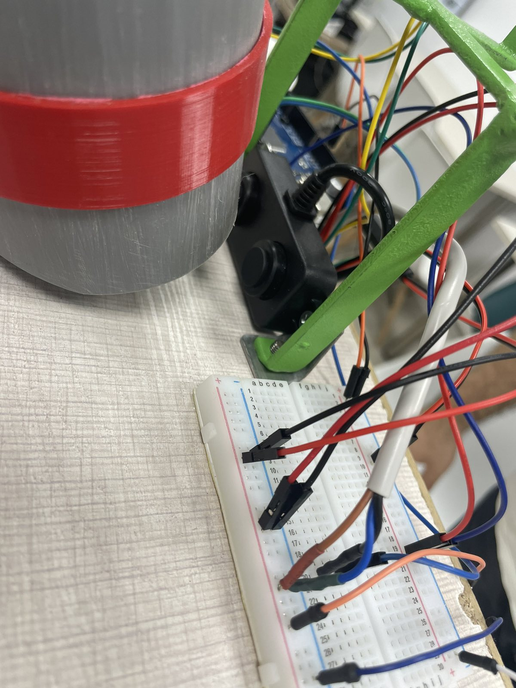 | 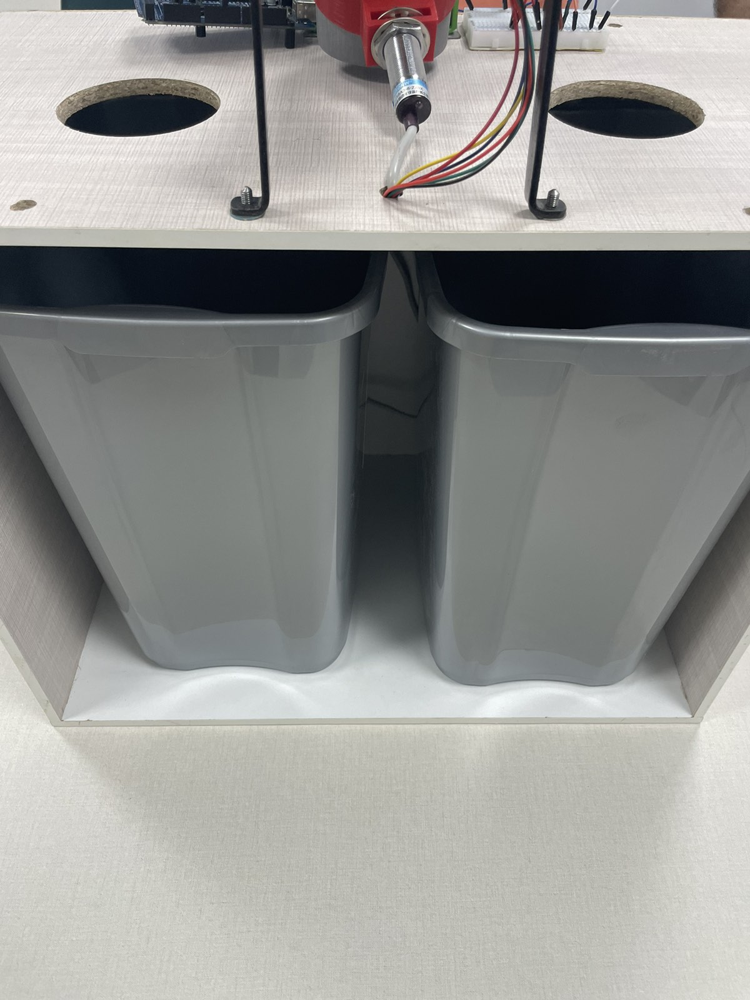 | 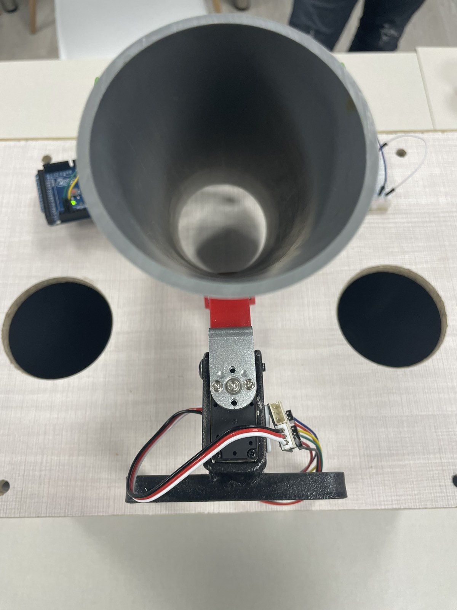 |
|    Leonardo Programming    |         Controller         |    Leonardo Programming     |
| 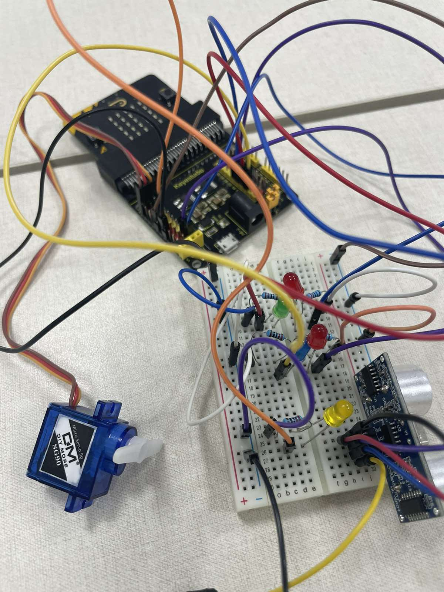 | 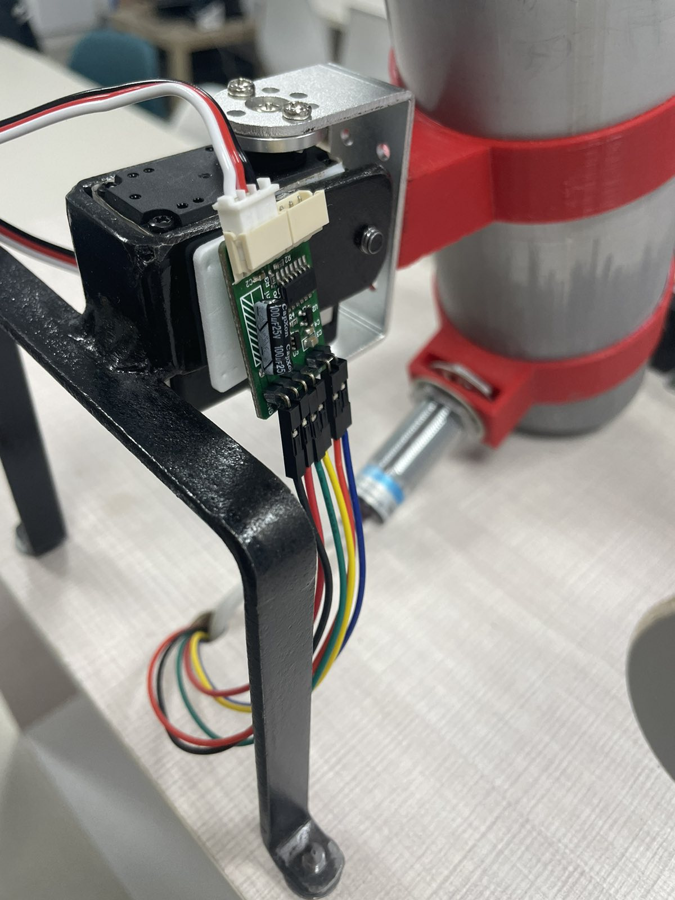 | 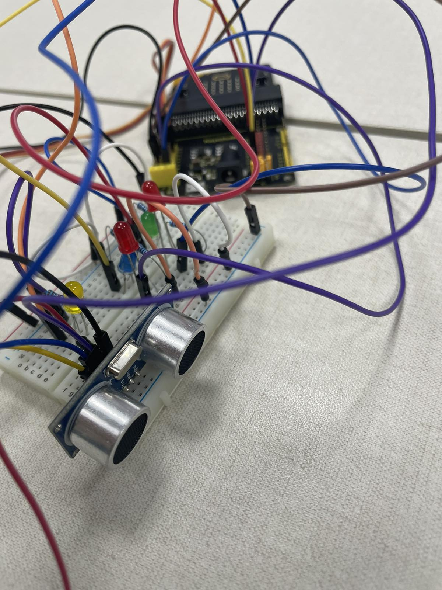 |

## Περιορισμοί
Η κατασκευή μας έχει κάποιους περιορισμούς. Έχουμε βάλει μικρής χωρητικότητας κάδους και θα πρέπει να τους αδειάζουμε 
τακτικά. Επίσης, οι διαστάσεις του πρωτότυπου (παρόντος) μοντέλου είναι μικρότερες για δοκιμαστικούς λόγους, αλλά 
και για να υπάρχει η δυνατότητα να μεταφέρεται εύκολα σε οποιοδήποτε χώρο χρειαστεί.

## 3D Μέρη
Το μηχανικό μέρος της κατασκευής είναι τρισδιάστατα σχεδιασμένος και εκτυπωμένος από εμάς. Το περίβλημα της 
κατασκευής αποτελείται από ξύλα πλακέ.

|          Side           |          Back           |          Upper           |
|:-----------------------:|:-----------------------:|:------------------------:|
| 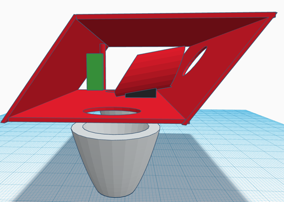 | 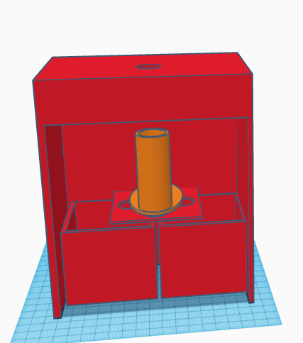 | 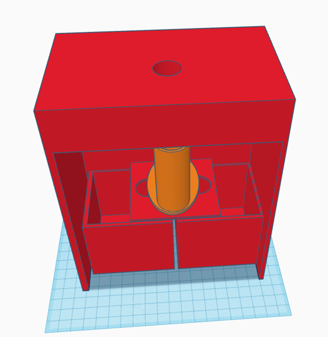 |

## Ηλεκτρικά μέρη
### _SCS15 Servo_
Ο σερβοκινητήρας αυτός, έχει τη δυνατότητα να λειτουργήσει σε λειτουργία σερβομηχανισμού και σε λειτουργία τροχού. 
Μπορεί να χρησιμοποιηθεί το εύρος από 0 έως 253 (0xFD). Ο σερβοκινητήρας αυτός διαθέτει μεταλλικά γρανάζια στο 
εσωτερικό του, κάτι που τον βοηθά να μετακινεί αντικείμενα μεγάλου βάρους (10+ κιλά). Μπορεί επίσης, να 
ανατροφοδοτήσει την τιμή της θέσης, της θερμοκρασίας, του φορτίου, της ταχύτητας και της τάσης εισόδου. 
Το SCServo είναι εύκολο να ελέγχεται από το Arduino.

### _Επαγωγικός Αισθητήρας Απόστασης - LJ18A3-8-Z/B_
Επαγωγικοί διακόπτες εγγύτητας, γνωστοί και ως επαγωγικοί αισθητήρες εγγύτητας. Ο διακόπτης περιέχει κύκλωμα 
ταλάντωσης υψηλής συχνότητας, κύκλωμα ανίχνευσης, κύκλωμα ενισχυτή, κύκλωμα λύσης και κύκλωμα εξόδου. Όταν η ισχύς 
παρέχεται στον διακόπτη, ο ταλαντωτής στο κύκλωμα ταλάντωσης υψηλής συχνότητας δημιουργεί ένα εναλλασσόμενο 
ηλεκτρομαγνητικό πεδίο στην επιφάνεια ανίχνευσης του διακόπτη. Όταν υπάρχει ένα μέταλλο κοντά στην επιφάνεια 
ανίχνευσης του διακόπτη, το ρεύμα μέσα στο μέταλλο απορροφά την ενέργεια του εναλλασσόμενου ηλεκτρομαγνητικού 
πεδίου στον ταλαντωτή. Ο ταλαντωτής αποδυναμώνεται ή σταματά. Εντοπίζοντας με αυτόν τον τρόπο, την παρουσία ή 
την απουσία του μετάλλου.

### _A02YYUW Waterproof Ultrasonic Distance Sensor_
Ο αισθητήρας απόστασης υπερήχων καθορίζει την απόσταση από έναν στόχο μετρώντας τα χρονικά διαστήματα μεταξύ 
της αποστολής και της λήψης του υπερηχητικού παλμού. Ο συγκεκριμένος αισθητήρας προσφέρει μεγάλη αξιοπιστία, 
με ποιότητα υψηλής απόδοσης, ευρύτερη γωνία ανίχνευσης, ακόμα και σε περιπτώσεις ομίχλης ή σκόνης. Ο λόγος που 
επιλέγαμε αυτόν τον αισθητήρα, είναι το γεγονός ότι είναι αδιάβροχος, κάτι που εξυπηρετεί πολύ τις ανάγκες τις 
κατασκευής μας.

|        SCS15 Servo         |      Επαγωγικός Αισθητήρας Απόστασης       |     Waterproof Ultrasonic Sensor     |
|:--------------------------:|:------------------------------------------:|:------------------------------------:|
| 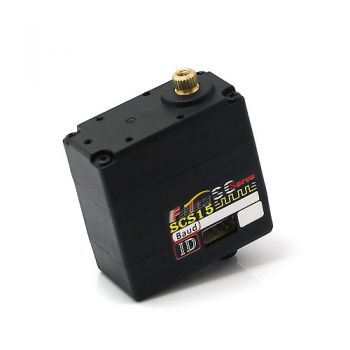 | 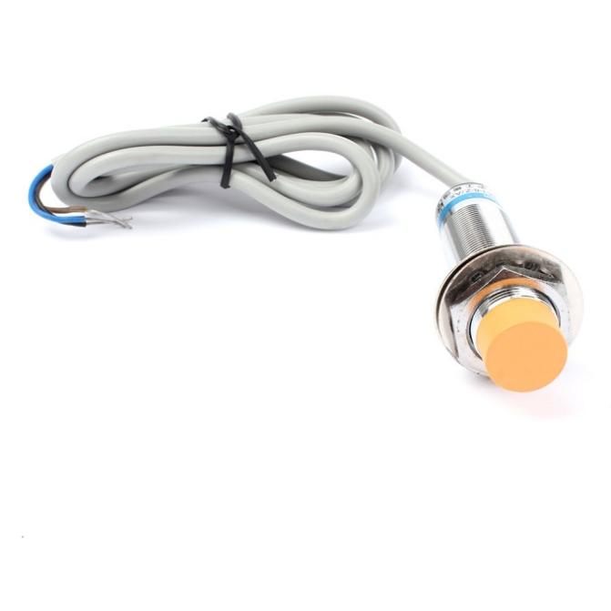 | 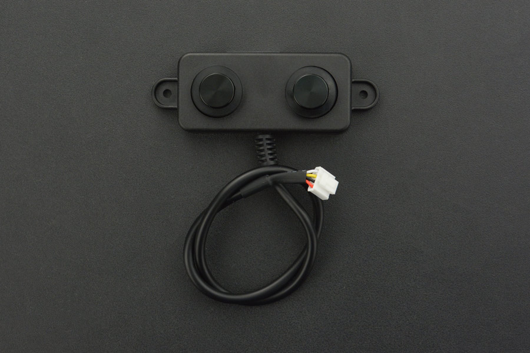 |

### _Arduino LEONARDO_
Για τον προγραμματισμό του συστήματος αυτού, χρησιμοποιήσαμε το Arduino LEONARDO. Το συγκεκριμένο Arduino, 
διαθέτει το εικονική σειριακή κονσόλα, το οποίο ήταν απαραίτητο για τη λειτουργία του σερβοκίνητηρα. Η κονσόλα αυτή 
είναι πολύ σημαντική, καθώς λειτουργεί ως εικονικός διαμεσολαβητής μεταξύ του υπολογιστή και του Arduino.

### _Τροφοδοσία_
Το συγκεκριμένο μηχάνημα τροφοδοτείται από μια μπαταρία 12 Volt. Ωστόσο, για να μειώσουμε τα volt και να μην 
κάψουμε τα εξαρτήματά μας, χρησιμοποιήσαμε ένα επιπλέον εξάρτημα, ένα step down. Με αυτό, καταφέραμε να μειώσουμε 
τα volt, δίνοντας στα εξαρτήματά μας τροφοδοσία 6 Volt.

### _Servo Controller_
Ο controller αυτός μας επιτρέπει να αλλάζουμε τον τρόπο συμπεριφοράς του ηλεκτροκινητήρα και ως εκ τούτου 
επιτρέπει μεγαλύτερη ευελιξία στη χρήση αυτών των μηχανών. Ένα τέτοιο σύστημα εξαρτημάτων υψηλής ακρίβειας 
επιτρέπει τον ακριβή έλεγχο θέσης, ταχύτητας και ροπής. Βοηθούν να ελαχιστοποιηθούν τα σφάλματα μεταξύ της 
εντολής του χειριστή και της εξόδου του κινητήρα.

|         Arduino LEONARDO         |             Step Down              |           Servo Controller           |
|:--------------------------------:|:----------------------------------:|:------------------------------------:|
| 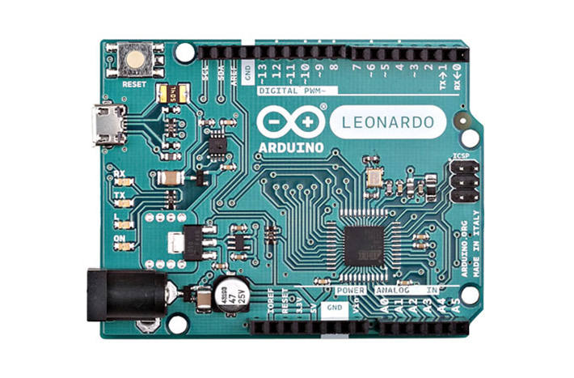 | 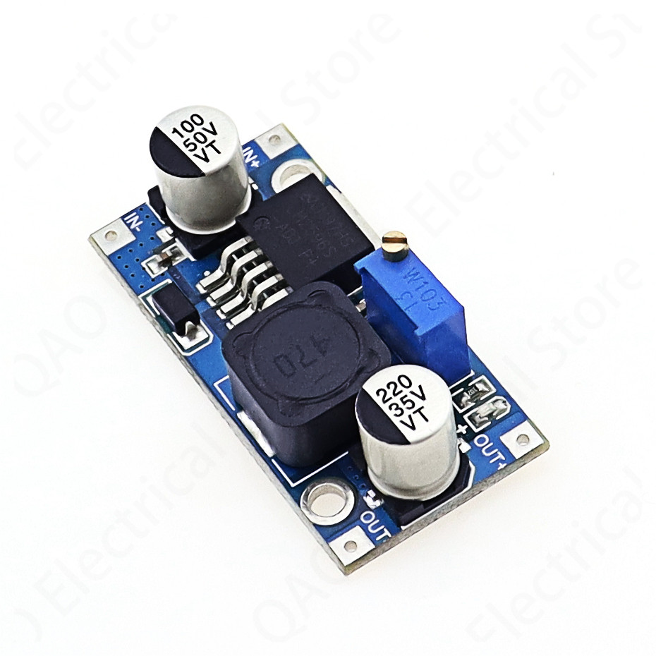 | 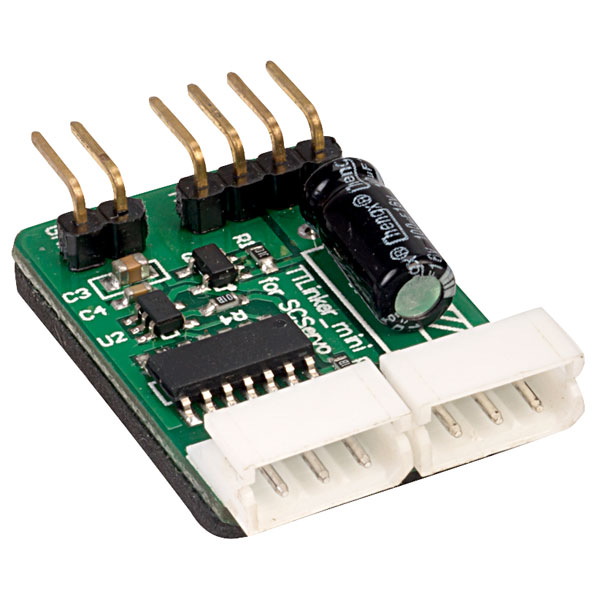 |

## Μελλοντικές Υλοποιήσει
Στους μελλοντικούς μας στόχους, σκοπεύουμε να αντικαταστήσουμε τους παρόντες κάδους, με άλλους μεγαλύτερης
χωρητικότητας, ώστε να μπορούν να αποθηκεύουν μεγαλύτερη ποσότητα απορριμμάτων. Επίσης, μια μελλοντική προσθήκη,
είναι ένας επιπλέον κάδος, στον οποίο θα συλλέγονται τα πλαστικά καπάκια. Τέλος, θα επιδιώξουμε την ενεργειακή
ανεξαρτητοποίηση της συσκευής μας, με την τοποθέτηση ηλιακών πάνελ.

## Το σύστημά μας στο Youtube (Click below)
[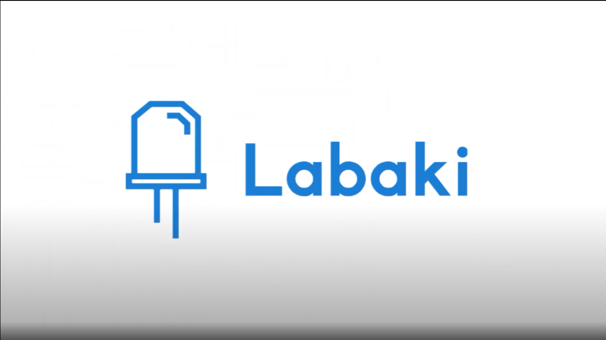](https://www.youtube.com/watch?v=6M-UcILnNKo)
